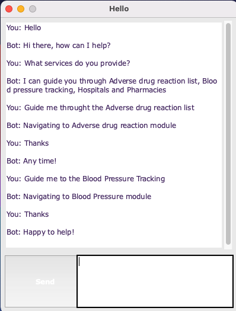

# Navigating Chatbot

The following chatbot is a Retrieval-Based Chatbot. The chatbot was trained on a dataset containing categories(intents), patterns and responses, using LSTM to classify which category the user's message belongs to. A random resopnse from a list of valid responses are taken and returned to the user.

The dataset was preprocessed using NLKT, and the model was built using Keras. An additional GUI module was built using TKinter.
The model, intents, words, and classes are loaded into the GUI module.

In order to run this project, you may retrain the model by running `python train_chatbot.py`, followed by running `python chatgui.py` to execute the GUI app.
